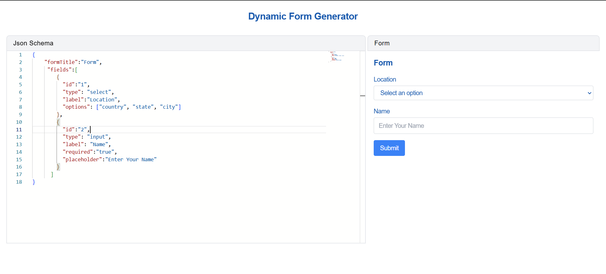

# JForm - Dynamic Form Generator
This repo contains the code for dynamic form generator build using React, Typescript, Monaco-Editor, React Hook Form and Zod for validation. JForm is an powerful tool designed to seamlessly transform your JSON input into fully functional HTML forms in real-time. Use the following example to see the form generated dynamically:

- JSON
```json
    {
     "formTitle":"Form",
     "fields":[
        {
          "id":"1",
          "type": "select",
          "label":"Location",
          "options": ["country", "state", "city"]
        },
        {
          "id":"2",
          "type": "input",
          "label": "Name",
          "required": true,
          "placeholder":"Enter Your Name" 
        }
      ]
    }
```
  - On submitting the form, the form data can be downloaded in your local drive.
- Output

  

 > [!NOTE] 
 > This website still lacks important features, so it may not meet your expectations.
 > Best Viewed on desktop PC or Laptop.
Check the [live](https://dynamic-form-generator-nu-lemon.vercel.app/) website here.

<!-- # React + TypeScript + Vite

This template provides a minimal setup to get React working in Vite with HMR and some ESLint rules.

Currently, two official plugins are available:

- [@vitejs/plugin-react](https://github.com/vitejs/vite-plugin-react/blob/main/packages/plugin-react/README.md) uses [Babel](https://babeljs.io/) for Fast Refresh
- [@vitejs/plugin-react-swc](https://github.com/vitejs/vite-plugin-react-swc) uses [SWC](https://swc.rs/) for Fast Refresh

## Expanding the ESLint configuration

If you are developing a production application, we recommend updating the configuration to enable type aware lint rules:

- Configure the top-level `parserOptions` property like this:

```js
export default tseslint.config({
  languageOptions: {
    // other options...
    parserOptions: {
      project: ['./tsconfig.node.json', './tsconfig.app.json'],
      tsconfigRootDir: import.meta.dirname,
    },
  },
})
```

- Replace `tseslint.configs.recommended` to `tseslint.configs.recommendedTypeChecked` or `tseslint.configs.strictTypeChecked`
- Optionally add `...tseslint.configs.stylisticTypeChecked`
- Install [eslint-plugin-react](https://github.com/jsx-eslint/eslint-plugin-react) and update the config:

```js
// eslint.config.js
import react from 'eslint-plugin-react'

export default tseslint.config({
  // Set the react version
  settings: { react: { version: '18.3' } },
  plugins: {
    // Add the react plugin
    react,
  },
  rules: {
    // other rules...
    // Enable its recommended rules
    ...react.configs.recommended.rules,
    ...react.configs['jsx-runtime'].rules,
  },
})
``` -->
